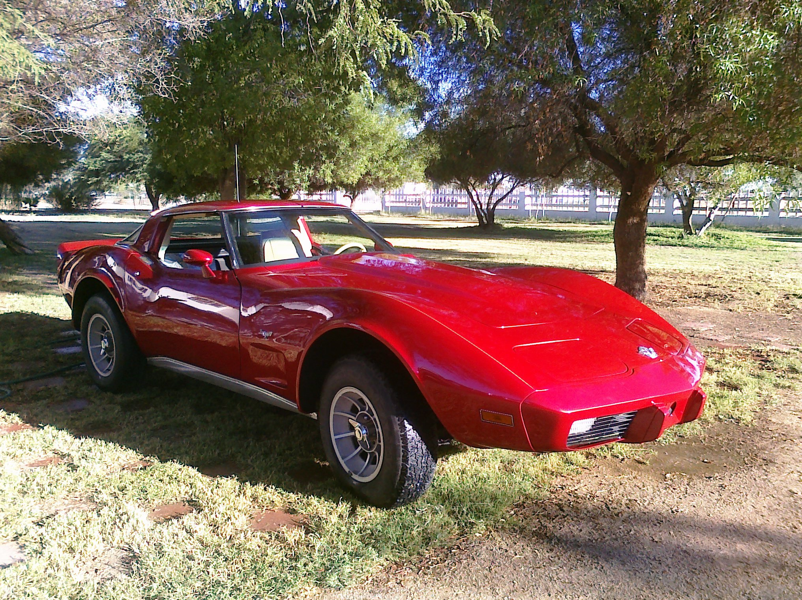
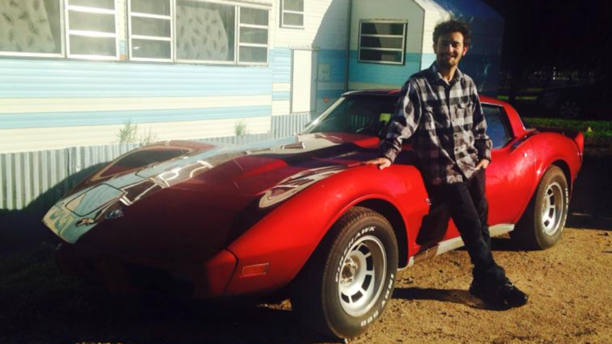
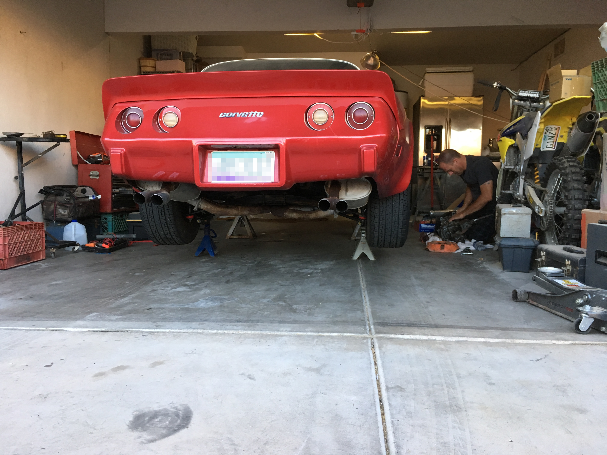
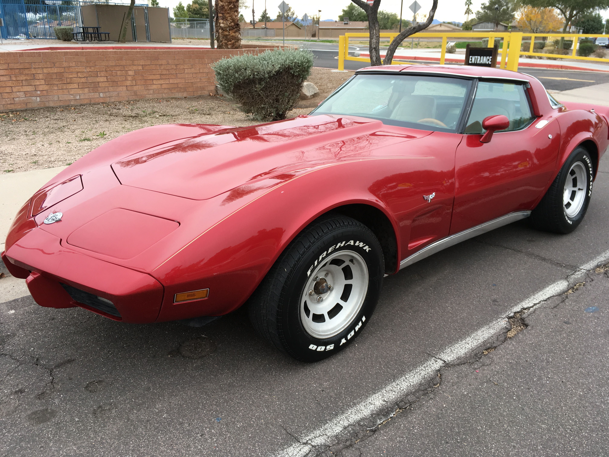

## The Electric Corvette

### The mission of this project is to make a performant and decently ranged electric vehicle out of my 1978 Chevrolet Corvette

### The Car

The car is a 1978 Chevrolet Corvette former pace car. It came stock with a small-block 350 with a 8.2:1 compression ratio. It has a torque rating of 280 lb-ft @ 2400 rpm and a curb weight of 3,529 lb. It has a rated power to weight ratio of Pounds / Horsepower: 20.70. It originally came with a 3 speed Turbo Hydra-Matic (Automatic) Transmission but I have replaced that with a 4 speed Borg Warner Super T-10 transmission.

### History

 I have always been a tinkerer. I have always enjoyed a project. I am concerned about our over reliance on fossil fuels and the impact of that on the world we leave behind when were gone. I love corvettes. I think that is why I have found my self at this project. I've owned the car since 2010 when I traded a Jeep CJ7 I owned for it.

It was a project car that my dad and I worked on on and off over the course of that time. We took the car from a literal box of parts to a running and driving car that I had to daily drive for a few short stretches of time. I have spent a lot of time working on this car, and at this point I feel like I know how it works inside and out. However this year is not the most performance oriented year for Corvettes and the power to weight ratio show it. Lets not get it twisted it's very fun to drive and has decent get up and go but I now own another EV and I have see the great things that [EV West](https://evwest.com/) have done and I want to see if I can do something similar here.

I am hopeful that with enough time and energy I can get aprox 100 mile range and roughly maintain the performance of the car. I consider it a success if I can keep the curb weight of the car under 4,100lbs and can do 0 - 60 in under 7 sec.
