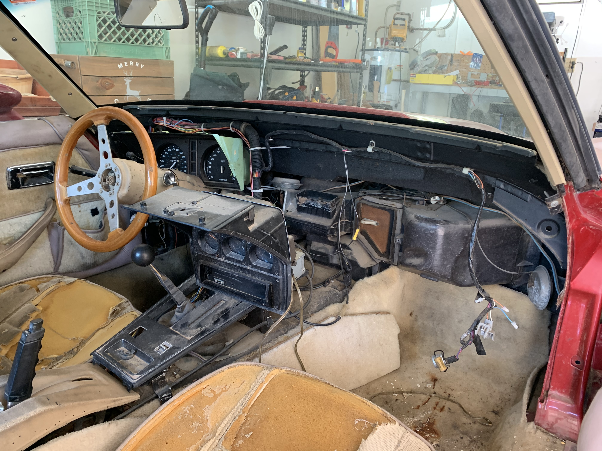
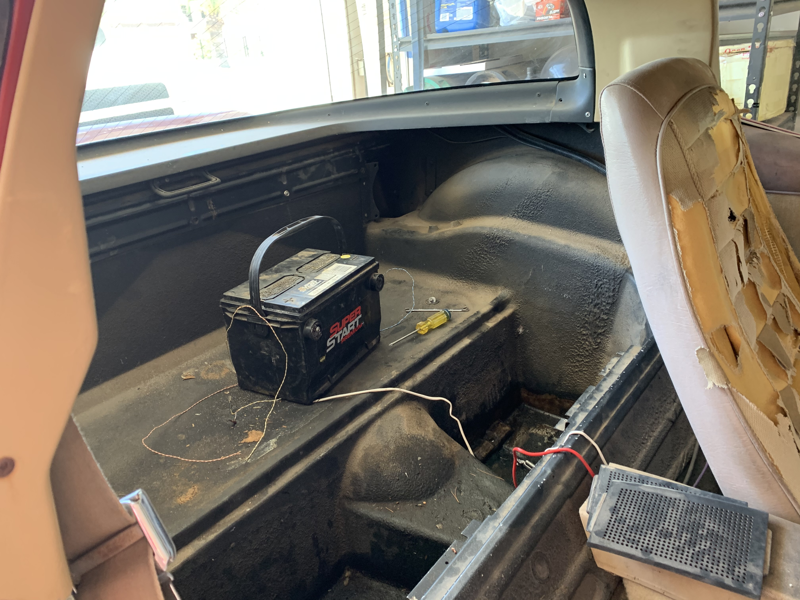
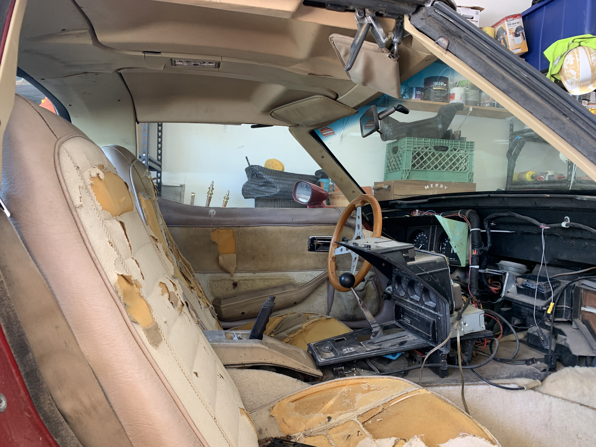
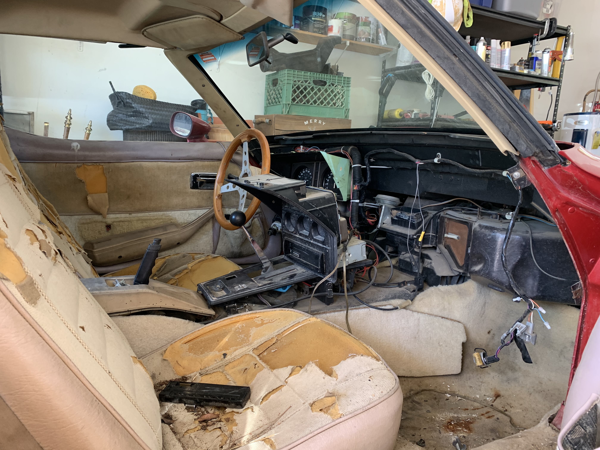

import engine from './engine.mp4'

### The work begins

I have retrieved the the car from my grandmas house where I had it parked for a while. There is definitely some signs rot and decay but when the battery had been charged the car started right up. I took a video with a timestamp of the engine running so that I have proof that its good when I go to sell it that way I can pull the motor and have it ready to go.

I'm asking $700 OBO by the way if anyone is intrested. Buyer pays for shipping. Email me if you intreated. [dldugan14@gmail.com](mailto:dldugan14@gmail.com)

 
 
<video width="100%" controls>
  <source src={engine} type="video/mp4" />
  Your browser does not support the video tag.
</video>
 
 

I have also torn out the cracked dashboard and ruined carpeting that I put in the better part of a decade ago. It's a real mess but that's ok as thats how projects often start.

 

Unfortunately as it stands, the project may have to slow down due to the COVID-19 situation. Doesn't mean I can't do any of the calculation and sourcing of the materials but I can't pull the motor by myself so theres only so much I can do phisically on the car.